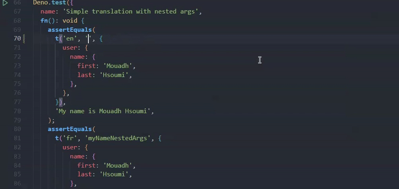

# T-i18n

A lightweighted internationalization module for Deno that is simple to use.

## Usage

> Use double brackets `{{some.variable}}` to allow unsafe variable content  
> check **_unsafeButDoNotEscape_** example

```javascript
import { initTranslation, load } from "https://deno.land/x/t_i18n/mod.ts";

const enTranslation = {
  welcome: 'Welcome',
  myName: 'My name is {first} {last}',
  myNameNestedArgs: 'My name is {user.name.first} {user.name.last}',
  this: {
    is: {
      nested: 'this is nested',
      nestedWith: { args: 'this should show nested arg named {arg.name}' },
    },
  },
  unsafe: 'this is unsafe {html}',
  unsafeButDoNotEscape: 'this is unsafe {{html}}',
};

load("en", enTranslation);

// First, we need to initialize the translation function.
// PS: Adding the type to the initTranslation allows you
//     to have an autocomplete of all your  translations keys
const t = initTranslation<typeof enTranslation>();

t("en", "welcome"); // "Welcome"

t("en", "myName", { first: "Mouadh", last: "Hsoumi" }); // "My name is Mouadh Hsoumi"

t("en", "myNameNestedArgs", {
  user: {
    name: {
      first: "Mouadh",
      last: "Hsoumi",
    },
  },
}); // "My name is Mouadh Hsoumi"

t("en", "this.is.nested"); // "this is nested");

t("en", "unsafe", { html: '' }); // "this is unsafe &lt;img src=&quot;url&quot; /&gt;"

t("en", "unsafeButDoNotEscape", { html: '' }); // 'this is unsafe '
```

## Methods

**load(locale: _string_, data: _Object_)**  
Load translation data for a particular locale.

**t(locale: _string_, key: **string**, args?: _Object_)**  
Single phrase translation for a specific locale at a specific key.
A data-containing object can also be passed as a parameter, allowing you to incorporate dynamic values into your translations.

**initTranslation<T>**  
Initialize the translation function
Having an autocomplete of all your translation keys is possible by including the type in the initTranslation.



## License

MIT
